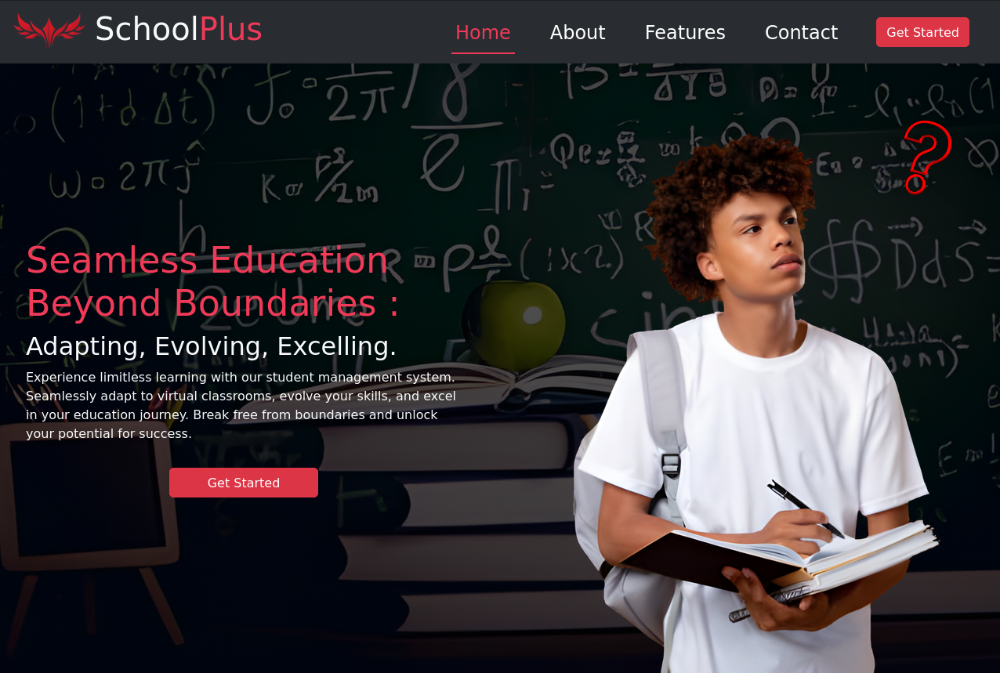
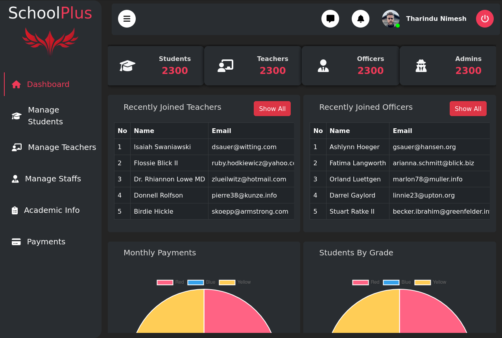
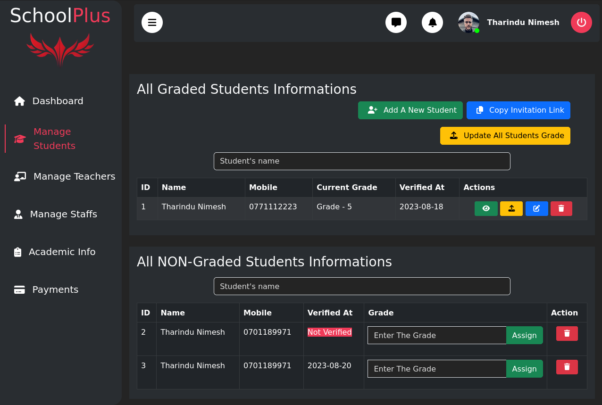
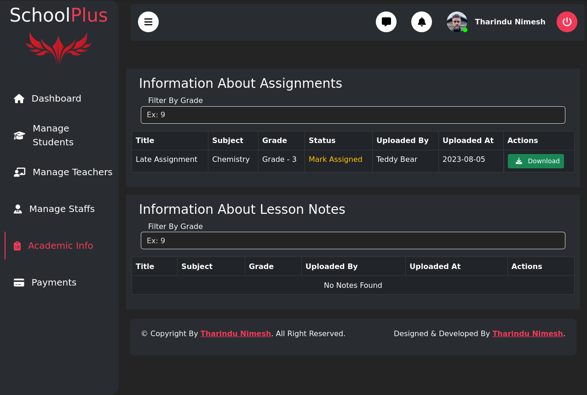

# Online Student Management System



## Project Background

During the pandemic period, traditional education methods were disrupted, leading to the need for efficient online education solutions. The Online Student Management System was developed as a response to this challenge. This web application provides a platform for administrators, teachers, students, and academic officers to interact seamlessly, ensuring uninterrupted education.

# Requirements

Before using the Online Student Management System, make sure you have the following software and tools installed on your system:

- PHP 8.1
- Composer
- MySQL 8
- Node.js 18+


## Installation

Before starting the installation, ensure that you have PHP 8.1, Composer, MySQL 8, and Node.js 18+ installed on your system. Follow these steps to set up the project:

1. Clone the repository or download the project folder from the provided link:
   ```bash
   git clone https://github.com/TharinduNimesh/online-student-management-system.git

2. Navigate to the project directory:
    ```bash 
   cd online-student-management-system
3. Install PHP dependencies using Composer:
    ```bash
    composer install
    composer update

4. Generate an application key:
     ```bash
    php artisan key:generate

5. Install JavaScript dependencies using npm:
    ```bash
    npm install

6. Create the database by running the __db.sql__ file located in the __db__ directory using a graphical database tool or the command line.

7. Rename .env.example to .env and configure environment variables (database settings, SMTP configuration, PayHere settings, etc.).
   1. **Database Configuration:**

   - `DB_HOST`: Your database host
   - `DB_PORT`: Your database port
   - `DB_DATABASE`: Your database name
   - `DB_USERNAME`: Your database username
   - `DB_PASSWORD`: Your database password

   2. **Gmail SMTP Configuration (For Email Verification and Notifications):**

   - `MAIL_MAILER`: smtp
   - `MAIL_HOST`: smtp.gmail.com
   - `MAIL_PORT`: 587
   - `MAIL_USERNAME`: Your email@gmail.com
   - `MAIL_PASSWORD`: Your email password
   - `MAIL_ENCRYPTION`: tls

   3. **PayHere Payment Gateway Configuration:**

   - `PAYHERE_MERCHANT_ID`: Your PayHere merchant ID
   - `PAYHERE_SECRET`: Your PayHere secret

Remember to rename `.env.example` to `.env` before setting up these configurations. Replace the placeholders with your actual values.

After setting up the `.env` file, your Online Student Management System will be ready to use with the specified configurations.
  

8. Start the development server:
      ```bash
      php artisan serve

9. Access the application in your web browser at __http://127.0.0.1:8000__.

## Project Background

During the pandemic period, traditional education methods were disrupted, leading to the need for efficient online education solutions. The Online Student Management System was developed as a response to this challenge. This web application provides a platform for administrators, teachers, students, and academic officers to interact seamlessly, ensuring uninterrupted education.

## Project Functionality

The Online Student Management System offers the following features and functionalities:

- **Admin Features:**
  - Manage users, invite teachers and academic officers, check results, and more.

- **Teacher Features:**
  - Add lesson notes, assignments, grade submissions, and profile updates.

- **Student Features:**
  - Download assignments, view lesson notes, upload answers, and update profiles.

- **Academic Officer Features:**
  - Register students, manage assignment marks, and update profiles.

- **Additional Features:**
  - Email verification for users, invitation system, billing, content access control, and more.


## Screenshots





# Used Technologies

The Online Student Management System is built using a variety of technologies to ensure a robust and user-friendly experience. The main technologies used in this project include:

- HTML5
- CSS3
- JavaScript
- AJAX
- Fetch API
- Laravel (PHP)
- MySQL

## Laravel Framework Components

- **Blade Templates:** Laravel's powerful templating engine for dynamic views and layouts.
- **Eloquent Database Models:** Laravel's ORM (Object-Relational Mapping) for easy interaction with the database.
- **Routes and MVC:** Utilizing Laravel's routing and Model-View-Controller architecture for structured development.

The application utilizes these technologies to create a seamless and efficient experience for administrators, teachers, students, and academic officers. It enables various functionalities such as user management, assignment submission, content access, and more.

## License

This project is licensed under the [MIT License](LICENSE.md).

## Copyright

&copy; 2023 Tharindu Nimesh

